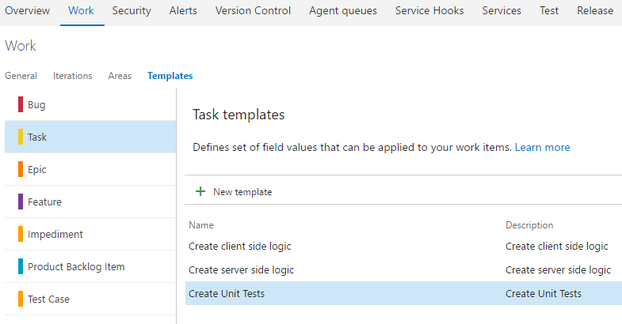
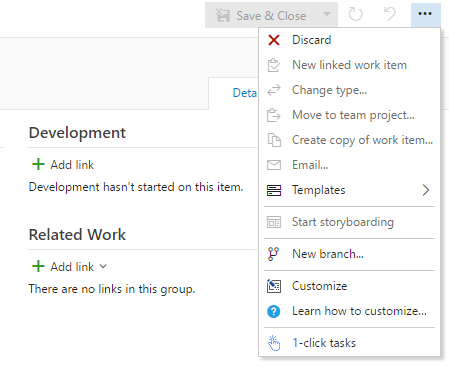
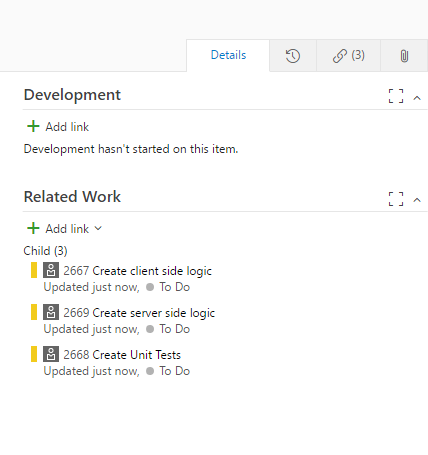

## 1-Click Tasks ##

Add tasks to User story or Bugs from predefined templates using a single click.

Team Services allows you to create work item templates.
With work item templates you can quickly create work items which have pre-populated values for your team's commonly used fields.

1-Click Tasks uses predefined task templates to add them to a User Story or Bug using a single click.

### Setup your Task templates ###

Create your task templates

### Create / open a user Story/Bug ###

Find 1-Click Tasks on toolbar menu

### Done ###

Now you have task associates with the Story/Bug

## Usage ##

1. Clone the repository
1. `npm install` to install required local dependencies
2. `npm install -g grunt` to install a global copy of grunt (unless it's already installed)
2. `grunt` to build and package the application

### Grunt ###

Basic `grunt` tasks are defined:

* `package-dev` - Builds the development version of the vsix package
* `package-release` - Builds the release version of the vsix package
* `publish-dev` - Publishes the development version of the extension to the marketplace using `tfx-cli`
* `publish-release` - Publishes the release version of the extension to the marketplace using `tfx-cli`

Note: To avoid `tfx` prompting for your token when publishing, login in beforehand using `tfx login` and the service uri of ` https://marketplace.visualstudio.com`.

## Credits ##

Clone from https://github.com/cschleiden/vsts-extension-ts-seed-simple
