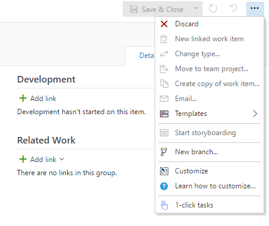

## 1-Click Tasks ##

Team Services allows you to create work item templates.
With work item templates you can quickly create work items which have pre-populated values for your team's commonly used fields.

1-Click Tasks uses predefined task templates and add them to a User Story or Bug using a single click.

### Setup your Task templates ###

Create your task templates

### Create / open a user Story/Bug ###

Find 1-Click Tasks on toolbar menu

### Done ###

Now you have tasks associated with the User Story or Bug

## Learn more ##

The <a href="https://github.com/figueiredorui/1-click-tasks" target="_blank">source</a> for this extension is on GitHub. Take, fork, and extend.

Let's discuss <a href="https://github.com/figueiredorui/1-click-tasks/issues" target="_blank">Issues and Improvements</a>